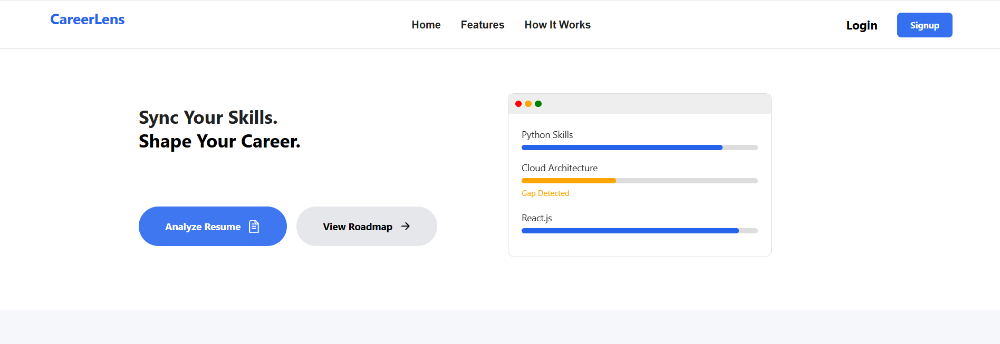
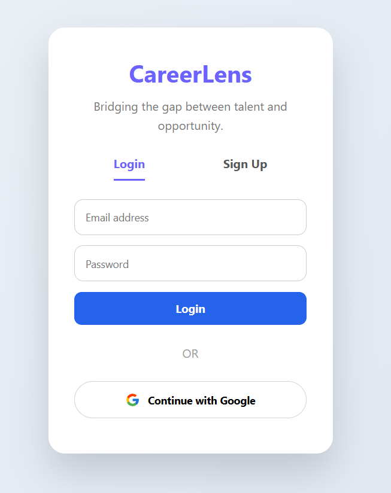
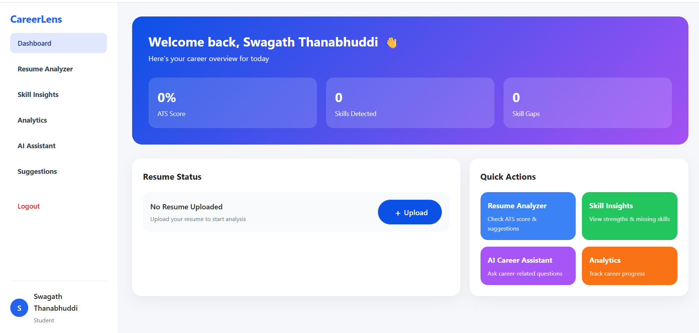
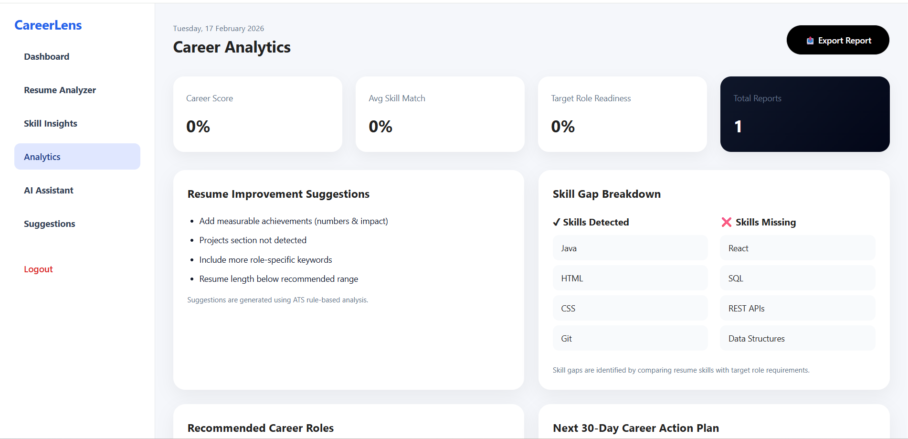

# CareerLens AI 🚀

CareerLens AI is an intelligent resume analysis platform designed to help students and job seekers
evaluate resume quality, identify skill gaps, and receive AI-powered improvement suggestions.

The application mimics how modern Applicant Tracking Systems (ATS) and recruiters evaluate resumes,
providing structured, data-driven insights that improve a candidate’s chances of selection.

---

## 🎯 Problem Statement

Many students and job seekers create resumes without understanding:

- Whether their resume matches industry expectations
- If important skills or keywords are missing
- How recruiters or ATS systems interpret resumes
- How to improve resumes effectively

Traditional resume building lacks intelligent, personalized feedback.

CareerLens AI solves this by combining resume analysis logic with AI-style evaluation techniques.

---

## 💡 Solution Overview

CareerLens AI provides:

✔ Resume structure understanding  
✔ Skill presence evaluation  
✔ Skill gap detection  
✔ ATS-style analysis logic  
✔ Improvement-oriented insights  

This enables users to improve resumes using **objective feedback instead of guesswork**.

---

## ✨ Features

- 📄 Resume Upload & Processing
- 🤖 Resume Analysis Engine
- 📊 ATS-Style Evaluation
- 🧠 Skill Gap Identification
- 🎯 Resume Quality Insights
- 🔐 Secure Backend APIs

---

## ⚙️ How the Application Works

1️⃣ User uploads resume via frontend interface  
2️⃣ Backend validates & processes file  
3️⃣ Resume content is analyzed  
4️⃣ ATS-style evaluation logic runs  
5️⃣ Skill gaps & insights generated  
6️⃣ Results displayed on dashboard  

---

## 🛠 Tech Stack

### ✅ Frontend
- React.js (Vite)

**Why React?**

✔ Component-based UI architecture  
✔ Efficient rendering & state handling  
✔ Industry-standard frontend framework  
✔ Scalable & maintainable design  

**Why Vite?**

✔ Extremely fast development server  
✔ Optimized modern build system  
✔ Better performance vs traditional tooling  

---

### ✅ Backend
- Node.js
- Express.js

**Why Node.js?**

✔ Fast & non-blocking execution model  
✔ Ideal for API-driven applications  
✔ Same language across stack (JavaScript)

**Why Express.js?**

✔ Lightweight & flexible  
✔ Clean REST API design  
✔ Industry-standard backend framework

---

### ✅ Deployment
- Netlify

**Why Netlify?**

✔ Optimized for React / Vite apps  
✔ Automatic CI/CD from GitHub  
✔ Global CDN & fast performance  
✔ Simple deployment workflow  

---

### ✅ Version Control
- GitHub

✔ Code management & history tracking  
✔ Professional portfolio visibility  
✔ Industry-standard collaboration platform  

---

## 🌐 Live Application

👉 https://careerlens-ai.netlify.app/

---

## 📸 Screenshots

### Landing Page


### Authentication


### Dashboard


### Resume Analysis


---

## 🚀 Run Locally

### Frontend (Vite)

```bash
cd CareerLens
npm install
npm run dev

```

## 👨‍💻 Author

Swagath Thanabuddi
