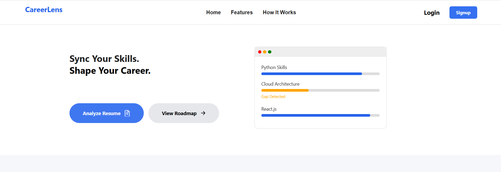
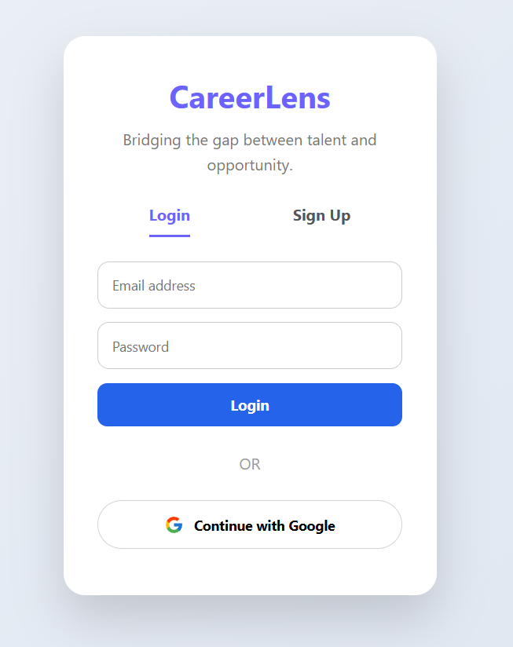
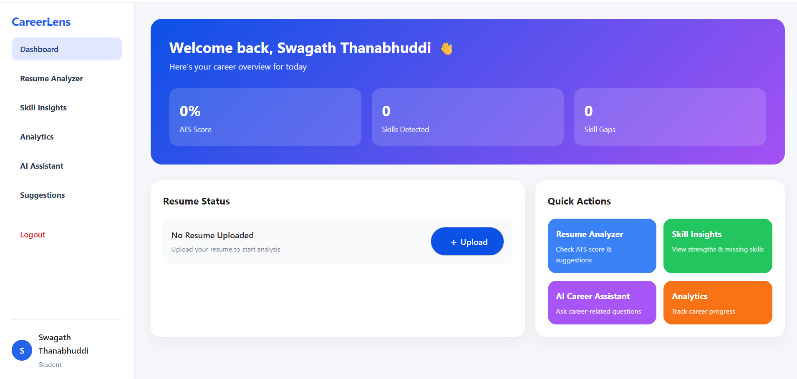
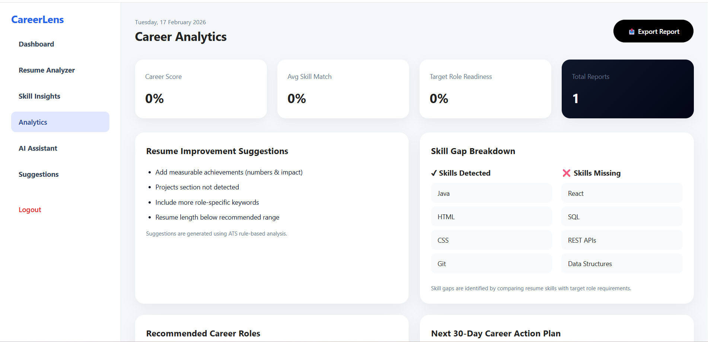

# CareerLens AI 🚀

CareerLens AI is an intelligent resume analysis platform designed to help students and job seekers evaluate resume quality, identify skill gaps, and receive AI-powered improvement insights.

The application mimics how modern Applicant Tracking Systems (ATS) and recruiters evaluate resumes, providing structured, data-driven insights that improve a candidate’s chances of selection.

---

## 🎯 Problem Statement

Many students and job seekers create resumes without understanding:

- Whether their resume matches industry expectations
- If important skills or keywords are missing
- How recruiters or ATS systems interpret resumes
- How to improve resumes effectively

Traditional resume building lacks intelligent, personalized feedback.

CareerLens AI solves this problem by combining resume analysis logic with ATS-style evaluation techniques.

---

## 💡 Solution Overview

CareerLens AI provides:

- Resume structure understanding
- Skill presence evaluation
- Skill gap detection
- ATS-style analysis logic
- Improvement-oriented insights

This enables users to improve resumes using **objective feedback instead of guesswork**.

---

## ✨ Features

- Resume Upload & Processing
- Resume Analysis Engine
- ATS-Style Evaluation
- Skill Gap Identification
- Resume Quality Insights
- Secure Backend APIs
- Resume Validation (detects non-resume documents)

---

## ⚙️ How the Application Works

1. User uploads resume via frontend interface  
2. Backend validates and processes the file  
3. Resume content is parsed and analyzed  
4. ATS-style evaluation logic runs  
5. Skill gaps and insights are generated  
6. Results are displayed on the dashboard  

---

## 🧩 System Architecture

User  
↓  
React Frontend (Vite)  
↓  
Node.js + Express Backend  
↓  
Resume Parser (pdf-parse)  
↓  
Skill Detection Engine  
↓  
ATS Score & Skill Gap Analysis  
↓  
Dashboard Results  

---

## 🛠 Tech Stack

### Frontend
- React.js (Vite)
- JavaScript
- HTML5
- CSS3

### Backend
- Node.js
- Express.js
- Multer (File Upload Handling)
- pdf-parse (Resume Text Extraction)

### Authentication
- Firebase Authentication
- Google Sign-In

### Deployment
- Netlify (Frontend)
- Render (Backend)

### Version Control
- Git
- GitHub

---

## 🌐 Live Application

- https://careerlens-app.netlify.app/

---

## 🌐 Backend API

- https://careerlens-nelo.onrender.com/health

---

## 📸 Screenshots

### Landing Page


### Authentication


### Dashboard


### Resume Analysis


---

## 🚀 Run Locally

### Frontend

```bash
cd CareerLens
npm install
npm run dev
```

### Backend

```bash
cd careerlens-backend
npm install
node server.js
```

---

## 📊 Example ATS Skill Detection

CareerLens checks resumes for common full-stack skills such as:

- HTML
- CSS
- JavaScript
- React
- Node.js
- Express
- MongoDB
- SQL
- Git
- GitHub
- REST API
- Docker
- AWS

The ATS score is calculated based on how many required skills appear in the resume.

---

## 👨‍💻 Author

- Swagath Thanabuddi
- Computer Science Engineering Student
- GitHub: https://github.com/swagath09
